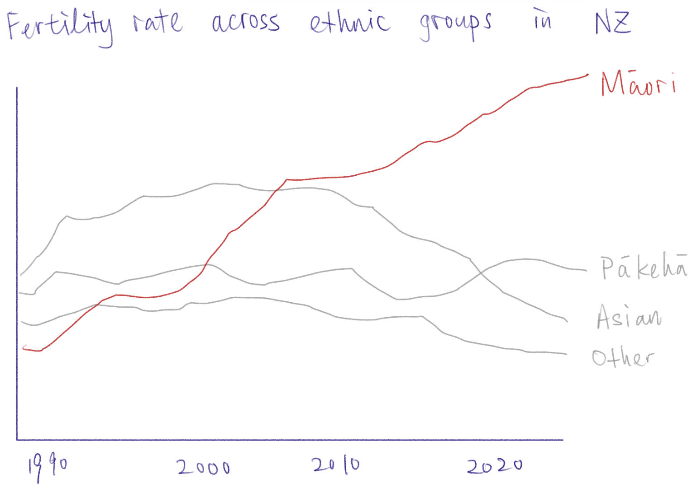
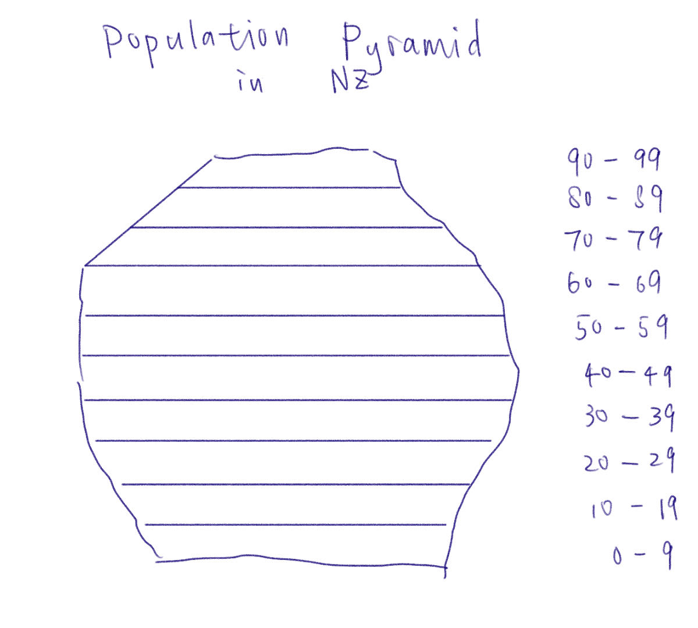
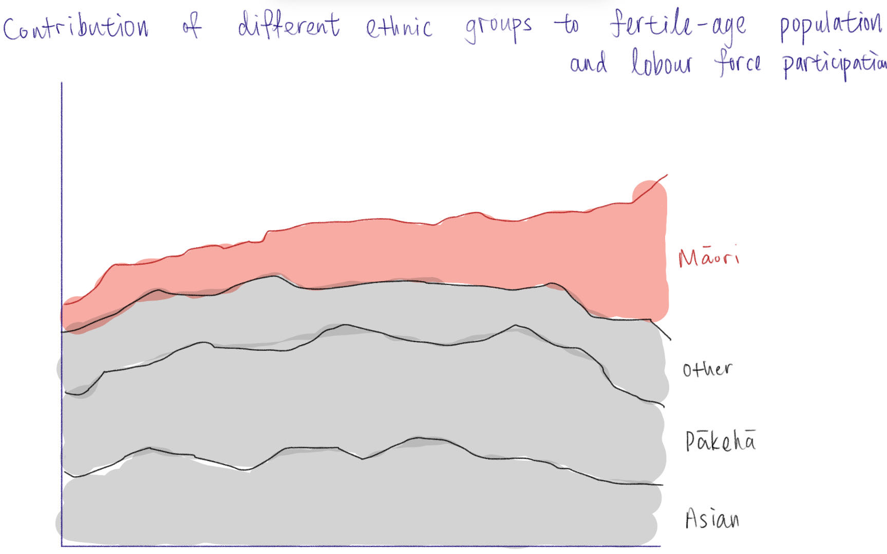
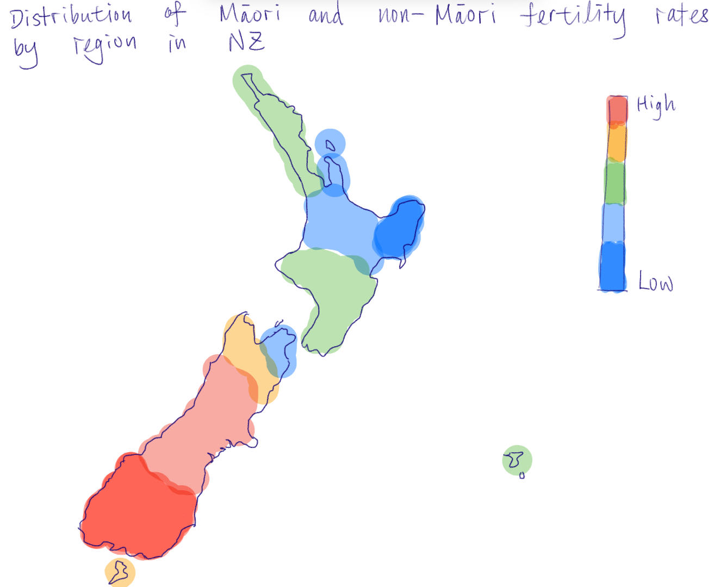
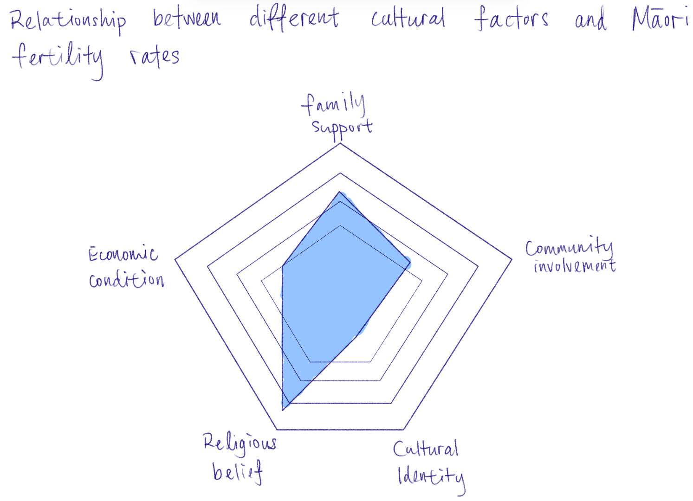
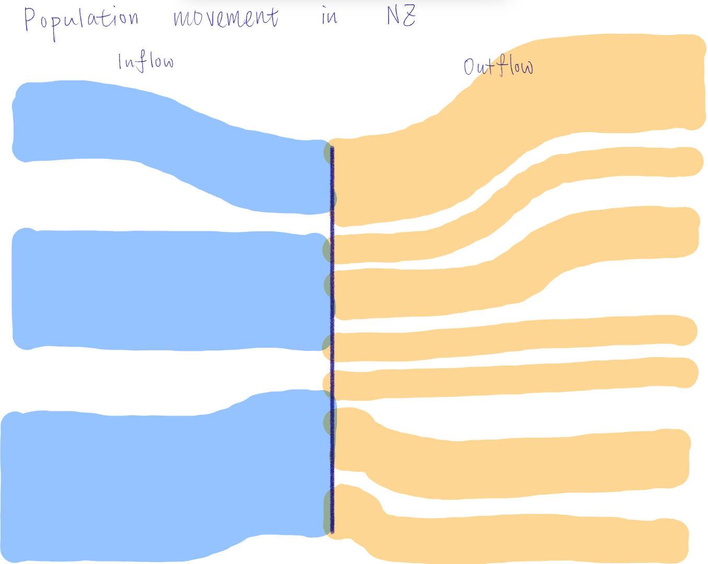
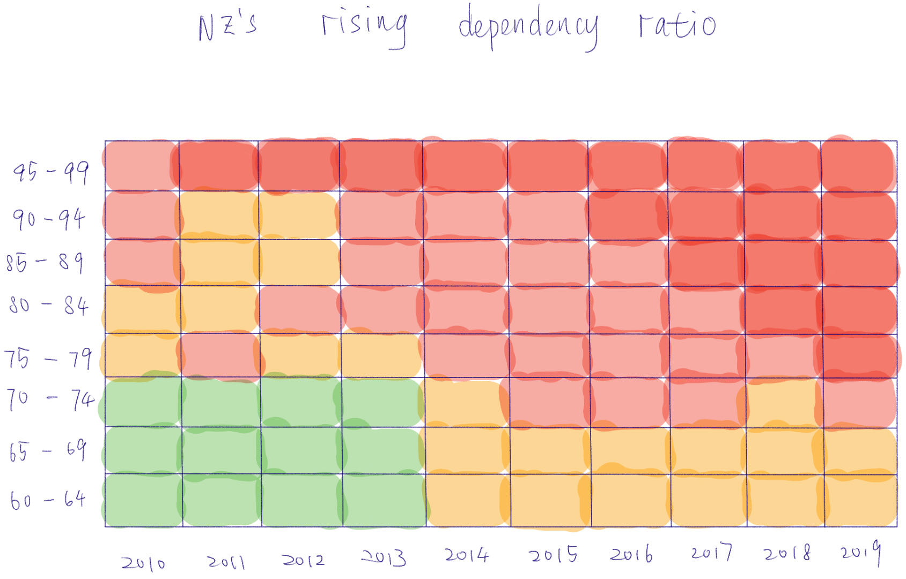
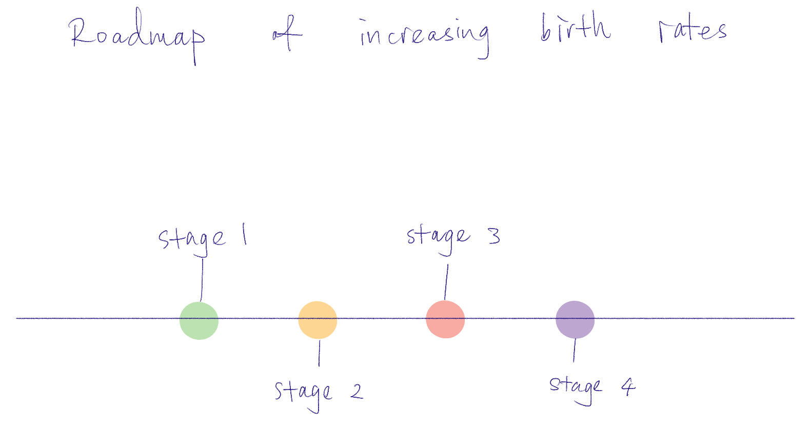

| [home page](https://francesxliu.github.io/DataVizPorfolio/) | [visualizing debt](visualizing-government-debt) | [critique by design](critique-by-design) | [final project I](final-project-part-one) | [final project II](final-project-part-two) | [final project III](final-project-part-three) |

# Diverging Demographics: How Māori Birth Rates Sustain New Zealand’s Population Amid a National Fertility Decline

# Outline
In my final project, I will focus on demonstrating demographic trends in New Zealand, particularly differences in fertility rates between ethnic groups. With the general decline in fertility rates globally, New Zealand's total population growth is also facing serious challenges, particularly with the gradual slowdown in birth rates for Pākehā (European New Zealanders) and other non-Māori ethnic groups, which have fallen below population replacement levels. However, Māori fertility rates remain high, which creates a different dynamic in New Zealand's overall demographic trends.

Through this project, I hope to visualise changes in the fertility rates of New Zealand's different ethnic groups and the impact of these changes on the country's demographics. I will focus on why Māori ethnicity has relatively high fertility rates, analysing the cultural, social and economic factors behind this and showing how these fertility patterns contrast with the fertility trends of other ethnicities. My goal is to tell the story of the complexities of New Zealand's response to demographic challenges through data visualisations, and in particular how policy interventions can balance fertility differences between ethnicities to ensure the country's long-term demographic sustainability.

## Project Structure:
### Introduction: Setting the Scene
Begin with a striking contrast: New Zealand's national fertility rate is in steep decline, with birth rates well below replacement level for most ethnic groups, except for the Māori community. This sets the stage for the following question: what makes Māori different?
#### Charts:
- Show the total fertility rate (TFR) for different ethnic groups in New Zealand, including Pākehā, Asian, Pacific Islander and Māori. Data sources can be Stats NZ and Te Ara.
- Compare New Zealand's overall fertility rate with the fertility rates of Māori and non-Māori ethnic groups. Demonstrate trends in New Zealand's fertility rates by ethnicity over the last few decades.

### Increased tensions: population decline
Overall population growth in New Zealand is under pressure due to declining birth rates among Pākehā (New Zealand Europeans) and other ethnic groups. The economic and social impacts of this trend are highlighted - an ageing population, a shrinking labour force, and fewer children in school.
#### Charts:
- The population pyramid chart illustrates the age structure of New Zealand's different ethnic groups, particularly the trend towards increased ageing, highlighting the impact of declining birth rates on the future labour force.
- Compare labour force participation rates and the proportion of the population of women of childbearing age by ethnicity show how declining fertility affects future economic development and social welfare systems.

### Unexpected Heroes: The Maori Difference
Explore why Māori have higher fertility rates. This section can delve into the cultural, social and economic factors that lead Māori women to have more children at a younger age. Emphasise community support and family values.
#### Charts:
- A map shows the distribution of Māori and non-Māori fertility rates by region in New Zealand, emphasising regional differences and geographical concentrations of higher Māori fertility rates.
- Demonstrate the relationship between different cultural factors (e.g. family support, community involvement, cultural identity) and Māori fertility rates to help explain the role of culture in high fertility rates.

### The challenge of sustained growth
Despite their higher birth rate, Maori alone cannot sustain the country's overall population growth. Discuss the risks of an ageing population and an outflow of New Zealand citizens.
#### Charts:
- Represent patterns of population movement and migration, showing the outflow of people out of New Zealand. Can visualise how immigration contributes to population growth, while showing the outflow of New Zealand citizens, particularly the younger generation.
- Show New Zealand's rising dependency ratio. The ratio compares the number of dependants (young and old) with the working-age population, highlighting the increased economic burden as the population ages.

### Call for action
Highlight potential solutions to New Zealand's demographic challenges. Discuss government policies aimed at encouraging higher birth rates, such as improved parental leave, family-friendly workplace practices, and supporting cultural sensitivity in Māori communities. Concludes with an optimistic view of how New Zealand can balance cultural diversity and population stability.
#### Charts:
- A timetable or roadmap for policy interventions aimed at increasing New Zealand's birth rate, with particular attention to initiatives targeting Māori and other ethnic groups.

## Initial sketches

# The data
In my project I will be using multiple data sources to show the demographic trends in New Zealand, specifically the difference in fertility rates between Māori and other ethnicities. I will focus on using official statistics from StatsNZ. In addition, I will cite some historical data from Te Ara and related research papers.

Some of the data comes from reports and articles, and although there is no direct raw data, this information provides insight into the cultural and social context of higher fertility amongst Māori ethnic groups. So I will still be using this data to create the visualisation charts.

| Name 	| URL 	| Description 	|
|---	|---	|---	|
| NZ is changing faster than the census can keep up – the 4 big trends to watch 	| https://researchcommons.waikato.ac.nz/entities/publication/95f1b27f-73b8-4248-a2bb-e2764e5a4be2 	| Report 	|
| First results from the 2023 Census – older, more diverse population, and an extra 300,000 people between censuses 	| https://www.stats.govt.nz/news/first-results-from-the-2023-census-older-more-diverse-population-and-an-extra-300000-people-between-censuses/ 	| Report with data 	|
| Population in NZ 	| https://www.stats.govt.nz/topics/population 	| StatsNZ 	|
| Births and deaths: Year ended June 2021 	| https://www.stats.govt.nz/information-releases/births-and-deaths-year-ended-june-2021 	| StatsNZ 	|
| Te whānau tamariki – pregnancy and birth 	| https://teara.govt.nz/en/graph/27632/maori-womens-fertility 	| Statistics 	|
| Māori fertility rate, 1844–2017 	| https://teara.govt.nz/en/graph/28742/maori-fertility-rate-1844-2017 	| Statistics 	|
| NGĀ HUA \| RESOURCES 	| https://www.kahuiraraunga.io/nga-hua-i-resources 	| Census Data 	|
| 2023 Census population counts (by ethnic group, age, and Māori descent) and dwelling counts 	| https://www.stats.govt.nz/information-releases/2023-census-population-counts-by-ethnic-group-age-and-maori-descent-and-dwelling-counts/ 	| Census Data 	|
| Understanding ‘higher’ Māori fertility in a ‘low’ fertility context: Does cultural identity make a difference? 	| https://researchcommons.waikato.ac.nz/entities/publication/95f1b27f-73b8-4248-a2bb-e2764e5a4be2 	| Research Paper 	|

# Method and medium
I plan to use Shorthand to design a story-centred visual narrative, ensuring that the data visualisation is closely aligned with the story line. I will use Tableau for data visualisation. In addition, I may use other tools such as Excel for data manipulation and then other image editing software to fine-tune the visualisation to make it more visually appealing.
